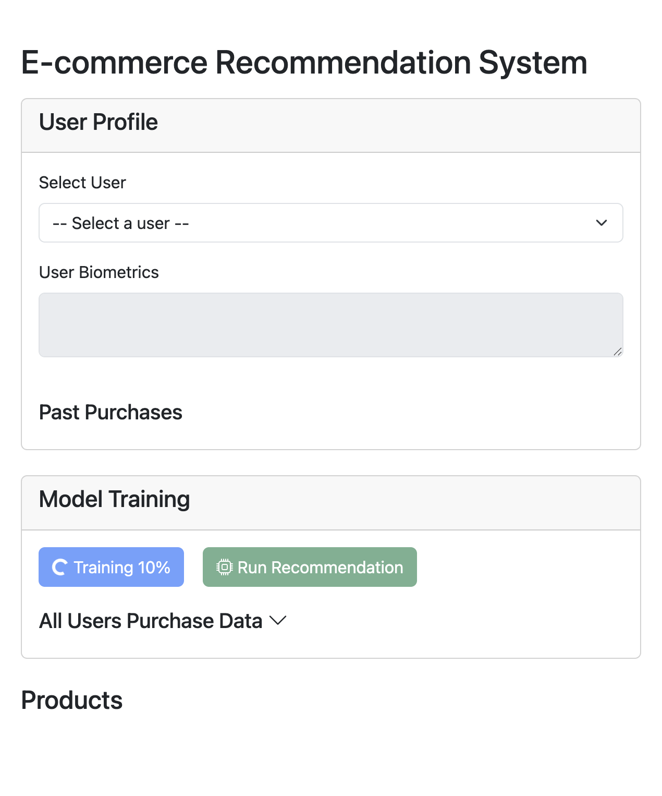
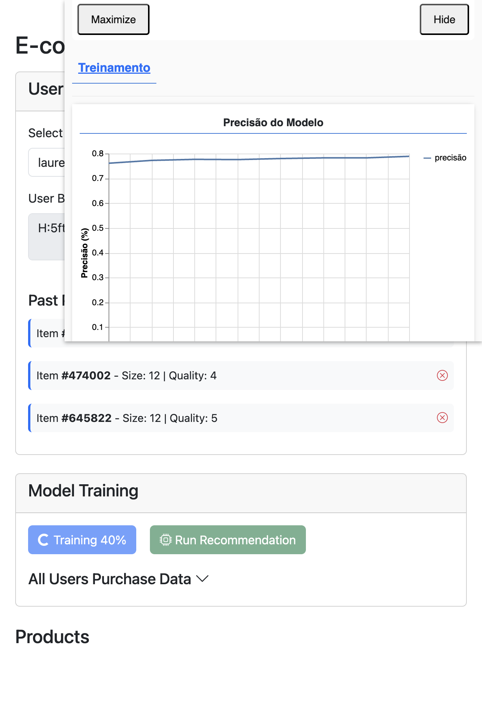

# 🛍️ Inteligência de Recomendação de Moda: O Provador Virtual

## 1. Visão Geral do Projeto
O mercado de moda online tem um problema recorrente: o cliente não consegue experimentar a peça antes da compra. Este projeto foi criado para reduzir essa incerteza com um **sistema de recomendação baseado em biometria física**.

Em vez de trabalhar apenas com histórico de compra, o sistema cruza as medidas da pessoa com o comportamento de compra de outros usuários parecidos. O resultado é uma recomendação mais próxima da realidade, com foco em caimento, compatibilidade e confiança na compra.

## 2. Objetivo
Transformar dados em uma experiência de compra mais segura e personalizada.

Os objetivos principais são:
* **Reduzir devoluções** ao sugerir peças com maior chance de servir bem.
* **Aumentar a conversão** ao diminuir a dúvida na hora da compra.
* **Personalizar a vitrine** com base nas características reais de cada cliente.

## 3. Demonstração Visual

As imagens abaixo mostram o sistema em funcionamento no navegador: a tela inicial com o treino do modelo em andamento e a tela após selecionar um usuário, exibindo biometria e histórico de compras.

## 4. Ferramentas e Tecnologias Utilizadas

### Front-end
* **HTML, CSS e JavaScript puro** para a interface principal.
* **Bootstrap** para estrutura visual dos cards, botões e componentes de tela.
* **Bootstrap Icons** para reforçar os estados visuais da aplicação.

### Inteligência Artificial e Modelagem
* **TensorFlow.js** para treinamento e inferência do modelo diretamente no navegador.
* **Web Worker** para executar o treino em segundo plano e evitar travar a interface.
* **Camadas Dense com ativação ReLU** para aprendizado do padrão entre usuário e produto.
* **Saída com Sigmoid** para gerar probabilidade de compatibilidade entre 0 e 1.

### Dados e Processamento
* **JSON** para armazenar usuários, produtos e bases agrupadas.
* **Normalização de dados** para colocar medidas diferentes na mesma escala.
* **Balanceamento de classes** para evitar que o modelo aprenda a dizer “não” para tudo.
* **Pré-processamento de biometria** com leitura de altura, cintura, quadril, busto e idade.

### Ferramentas de Desenvolvimento
* **Browser-sync** para rodar o projeto localmente com recarregamento automático.
* **Node.js** para scripts de apoio, organização de dados e testes de integração.

## 5. Como o Modelamento Foi Construído
O modelamento foi feito com uma lógica prática de recomendação orientada ao caimento da peça.

### 5.1 Base de entrada
O sistema trabalha com duas fontes principais:
* **Dados dos clientes**: medidas corporais e histórico de compras.
* **Dados dos produtos**: categoria e assinatura construída a partir de quem comprou cada item.

### 5.2 Representação dos dados
Cada cliente é convertido em um vetor numérico com suas medidas principais. Cada produto também vira um vetor, mas baseado na média corporal dos usuários que compraram aquele item.

### 5.3 Método usado
O processo combina três ideias:
1. **Normalização** das medidas para padronizar os valores.
2. **Codificação por atributos** para transformar usuário e produto em entrada de rede neural.
3. **Treinamento supervisionado balanceado** com exemplos positivos e negativos.

### 5.4 Balanceamento
Como há muito mais itens não comprados do que comprados, o treino foi ajustado com uma razão controlada entre exemplos positivos e negativos. Isso melhora a leitura do modelo e evita uma saída enviesada demais para zero.

### 5.5 Camadas de treino
O modelo foi treinado com uma rede neural simples e eficiente, adequada para o tipo de problema:
* entrada com dados do usuário + dados do produto;
* camadas ocultas para aprender padrões;
* saída probabilística para indicar compatibilidade.

## 6. Regras de Negócio Implementadas

* **Biometria é prioridade**: altura, cintura, quadril, busto e idade têm peso no cálculo.
* **Categoria também influencia**: o gosto do cliente por uma categoria de produto entra na conta.
* **O produto não é fixo por tamanho bruto**: ele recebe uma “assinatura” baseada no perfil de quem comprou antes.
* **O resultado é uma probabilidade**: o sistema não diz apenas sim ou não, mas o quanto a peça faz sentido para aquela pessoa.

## 7. Exemplo Prático: Lauren Polzin e o Item #659083
No caso da usuária Lauren Polzin, o sistema retornou uma chance intermediária para o item #659083 porque houve equilíbrio entre compatibilidade de estilo e divergência de medidas.

O modelo observou que:
* a Lauren tem altura próxima do perfil histórico de quem comprou a peça;
* ela demonstra interesse em categorias relacionadas;
* mas possui medidas de quadril e busto acima da média do grupo comprador daquele item.

Na prática, isso gera uma recomendação cautelosa: a peça pode agradar visualmente, mas o caimento não é tão garantido quanto em um perfil corporal mais próximo do histórico do produto.

## 8. Resultado Esperado
O sistema busca entregar recomendações mais inteligentes do que uma simples lista de produtos populares. A proposta é aproximar a experiência digital da sensação de um provador assistido por um vendedor atento.

## 9. Melhorias Futuras
Alguns próximos passos possíveis para evoluir o projeto:

1. **Incluir elasticidade do tecido** para diferenciar peças flexíveis de peças rígidas.
2. **Sugerir tamanho ideal automaticamente** com base no perfil corporal.
3. **Usar feedback de devolução** para ensinar o sistema com casos reais de erro.
4. **Criar métricas de validação** para acompanhar acerto, cobertura e taxa de conversão.
5. **Expandir a base de treino** com mais usuários, mais produtos e mais histórico.

## 10. Conclusão
Este projeto mostra como a combinação de dados de clientes, perfil de produtos e aprendizado de máquina pode criar uma experiência de compra mais confiável. O sistema não substitui a decisão humana, mas ajuda a reduzir dúvida, melhorar a assertividade e aumentar a confiança na compra online.

Em resumo, o provador virtual transforma dados em recomendação útil, simples de entender e com foco direto no que importa para o cliente: escolher melhor antes de comprar.